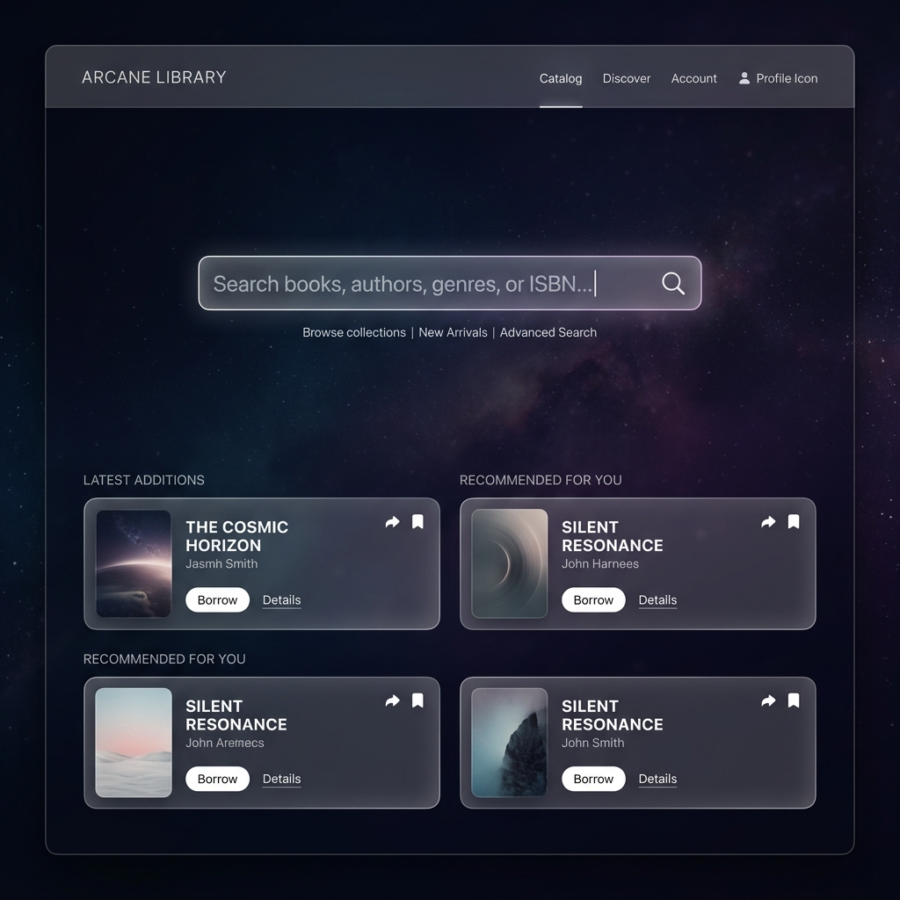

# 🌲 Rasamala Theme for SLiMS 9 Bulian


**Rasamala** adalah templat OPAC modern, cepat, dan kaya fitur untuk **SLiMS 9 Bulian**. Dikembangkan dengan pendekatan *mobile-first*, arsitektur PHP yang sangat rapi dan modular, serta kontrol kustomisasi visual penuh melalui **Tinfo (Pengaturan Tema)** tanpa menyentuh core SLiMS.



---

## 🎭 Filosofi Desain: Antara "Minimalis Anteng" dan "Pesta Visual"

Mari jujur sebentar: **tidak semua perpustakaan itu sama dan butuh selera yang seragam!** ☕✨

Ada perpustakaan yang sukanya tampil *super-clean*, hening, dan polos tanpa distraksi—mirip ruang baca sunyi tempat Anda bisa mendengar suara semut berbisik. Namun, tidak sedikit pula perpustakaan (terutama sekolah, kampus kekinian, atau perpustakaan umum interaktif) yang ingin OPAC-nya tampil **fun, atraktif, dan meriah** lengkap dengan animasi melayang, widget waktu sholat, *running text*, hingga *cursor neon* yang bikin pemustaka betah *scrolling*! 🚀

Karena itulah **Rasamala** dirancang fleksibel ibarat bunglon yang serba bisa:
- 🌿 **Ingin Tampilan Minimalis & Polos?** Cukup pilih preset *Simple*, matikan animasi & partikel cursor. Hasilnya: OPAC super cepat, bersih, dan fokus pada pencarian tanpa distraksi.
- 🎉 **Ingin Tampilan Meriah & Interaktif?** Aktifkan preset *Full*, hidupkan *Background Animation*, pasang *Cursor Particles*, tambah widget WhatsApp & waktu sholat. Hasilnya: OPAC bergaya portal modern yang *Instagrammable* dan memanjakan mata pemustaka!

Apapun selera kepustakawanan Anda—mulai dari aliran *"Harap Tenang, Perbanyak Membaca"* sampai aliran *"Perpustakaan Ramai, Pemustaka Ceria"*—Rasamala siap memfasilitasinya hanya dengan beberapa klik di Tinfo! 🎛️

---

## 📑 Daftar Isi

- [🎭 Filosofi Desain: Antara "Minimalis Anteng" dan "Pesta Visual"](#-filosofi-desain-antara-minimalis-anteng-dan-pesta-visual)
- [⚡ Sorotan Utama](#-sorotan-utama)
- [🎛️ Panduan Lengkap Pengaturan Tema (Tinfo)](#️-panduan-lengkap-pengaturan-tema-tinfo)
  - [1. 🎨 Preset & Skema Warna (Color Palette)](#1--preset--skema-warna-color-palette)
  - [2. 🌙 Dark / Light Mode](#2--dark--light-mode)
  - [3. 🧭 Navbar, Header & Kartu Anggota Digital](#3--navbar-header--kartu-anggota-digital)
  - [4. 🔍 Hero & Kotak Pencarian (Search Box)](#4--hero--kotak-pencarian-search-box)
  - [5. 🔮 Animasi Background & Efek Cursor](#5--animasi-background--efek-cursor)
  - [6. 📢 Pengumuman & Running Text](#6--pengumuman--running-text)
  - [7. 📰 Beranda, News & Section Manager](#7--beranda-news--section-manager)
  - [8. 🗺️ Peta, Sosial Media & Footer](#8--peta-sosial-media--footer)
  - [9. 🕌 Widget Waktu Sholat & Floating Reminder](#9--widget-waktu-sholat--floating-reminder)
  - [10. 🏛️ Visitor Log (Buku Tamu Kiosk & Split Layout)](#10--visitor-log-buku-tamu-kiosk--split-layout)
  - [11. 💬 Floating Action & WhatsApp Service Widget](#11--floating-action--whatsapp-service-widget)
  - [12. 📊 Search Result, Detail Buku & Sitasi](#12--search-result-detail-buku--sitasi)
- [🪪 Fitur Kartu Anggota Digital (Member Area)](#-fitur-kartu-anggota-digital-member-area)
- [🧺 Keranjang Buku (Shopping Basket) & AJAX Real-Time](#-keranjang-buku-shopping-basket--ajax-real-time)
- [🤖 Panduan Pembuat Custom Palette Berbasis AI](#-panduan-pembuat-custom-palette-berbasis-ai)
- [📁 Arsitektur Direktori & Struktur File](#-arsitektur-direktori--struktur-file)
- [🛡️ Keamanan & Aksesibilitas](#-keamanan--aksesibilitas)
- [🚀 Cara Instalasi](#-cara-instalasi)
- [👥 Kredit & Pengembang](#-kredit--pengembang)

---

## ⚡ Sorotan Utama

- 🎨 **Kustomisasi Visual Lengkap via Tinfo:** Seluruh komponen tampilan dapat dikonfigurasi melalui panel admin tanpa perlu mengubah kode sumber.
- 📱 **Mobile-First Experience:** Dilengkapi *Mobile Bottom Navigation Bar 5-tombol*, sheet menu *"Lainnya"*, serta modal Filter & Sort bergaya aplikasi modern (Tokopedia/Shopee).
- 🪪 **Kartu Anggota Digital Cerdas:** Mendukung format QR Code & Barcode, generator inisial nama jika foto tidak ada, serta indikator visual **border merah melingkar** otomatis untuk status expired/non-aktif.
- 🧺 **Permanent Shopping Basket:** Tombol keranjang buku (`fas fa-shopping-basket`) selalu tampil di navbar atas & posisi tengah navigasi mobile, lengkap dengan *badge counter AJAX real-time*.
- 🕌 **Widget Waktu Sholat Indonesia:** Menampilkan waktu sholat berikutnya di footer serta *floating reminder countdown* menjelang azan untuk kota-kota di Indonesia.
- 🤖 **Interactive Theme Viewer & AI Palette Generator:** Pengunjung dapat melakukan preview palette, font, animasi, dan partikel cursor via floating menu OPAC, lengkap dengan generator prompt AI.
- 🏛️ **Visitor Log Kiosk / Split Mode:** Buku tamu mendukung format institusi `kode(label)`, opsi ketik manual (`other`), serta kartu petunjuk HTML yang disanitasi.
- 🚀 **100% Aset Lokal (Offline Ready):** Font Google (Inter, Roboto, Poppins, Playfair Display), Font Awesome, Bootstrap 5.3.3, dan Vue 3.5.39 disimpan lokal di folder templat.

---

## 🎛️ Panduan Lengkap Pengaturan Tema (Tinfo)

Pengaturan tema Rasamala dapat diakses melalui admin SLiMS pada menu **System > Theme > Customize/Tinfo**. Berikut adalah rincian opsi yang tersedia:

### 1. 🎨 Preset & Skema Warna (Color Palette)

- **Preset Tampilan Tema (`classic_theme_preset`):**
  - ⚡ **Simple (Search + Running Text):** Tampilan sangat minimalis, fokus utama pada kotak pencarian dan running text.
  - 📚 **Simple + Topics:** Beranda ringkas dengan kotak pencarian dan ikon topik favorit.
  - 🌟 **Full (Topics + News + Collections + Top Reader + Map):** Menampilkan seluruh modul beranda secara lengkap.
  - 🔓 **Custom (Fully Unlocked):** Membuka kontrol manual penuh untuk seluruh section.
- **Color Palette Preset (`classic_color_palette`):**
  - 🌿 **Warm Gray** (Default akademis elegan)
  - ⚪ **Minimal White** (Bersih & minimalis)
  - 🖤 **Dark Gray** (Nuansa gelap modern)
  - 💙 **Clean Blue** (Biru profesional)
  - 📖 **Warm Library** (Nuansa kayu & kertas klasik)
  - 🎨 **Custom Palette** (Menggunakan kombinasi warna kustom Anda)
- **Custom Palette Colors (`classic_custom_palette_colors`):**
  - Format input: `Light Primary; Secondary; Accent; Background; Surface; Text; Muted | Dark Primary; Dark Secondary; Dark Accent; Dark Background; Dark Surface; Dark Text; Dark Muted`

---

### 2. 🌙 Dark / Light Mode

- **Pilihan Mode (`classic_color_mode`):**
  - 🌗 `auto - button show`: Otomatis mengikuti OS/browser pengguna + menampilkan tombol toggle.
  - 🙈 `auto - button hide`: Otomatis mengikuti OS/browser pengguna tanpa tombol toggle.
  - 🌙 `default dark - button show`: Default mode gelap + tombol toggle.
  - 🙈 `default dark - button hide`: Kunci di mode gelap tanpa tombol toggle.
  - ☀️ `default light - button show`: Default mode terang + tombol toggle.
  - 🙈 `default light - button hide`: Kunci di mode terang tanpa tombol toggle.

---

### 3. 🧭 Navbar, Header & Kartu Anggota Digital

- **Posisi Logo & Nama Perpustakaan (`classic_logo_position`):**
  - 📌 `Navbar`: Logo dan nama perpustakaan berada di dalam baris navbar.
  - 🎯 `Hero Box`: Logo dan nama dipindahkan di atas kotak pencarian (Desktop).
- **Subnama Perpustakaan (`classic_show_subname`):** Tampilkan atau sembunyikan subnama perpustakaan.
- **Pengaturan Navbar Menu (`classic_navbar_menus`):** Konfigurasi menu navigasi atas lengkap dengan ikon Font Awesome.
- **Area Anggota (`classic_member_area`):** Tampilkan atau sembunyikan tautan Member Area.
- **Tipe Kode Kartu Anggota (`classic_card_code_type`):**
  - 📱 `QR Code` (BaconQrCode Svg Renderer)
  - ║▌ `Barcode` (PHPBarcode Code128)
- **Field Kartu Anggota (`classic_card_show_fields`):** Pilih atribut yang ditampilkan (Nama, ID, Institusi, Tipe Anggota).
- **Mobile Bottom Navigation Bar (`classic_mobile_bottom_nav_show`):** Tampilkan atau sembunyikan bilah navigasi bawah ponsel 5-tombol.
- **Daftar Kode Bahasa (`classic_language_selection_list`):** Membatasi bahasa yang muncul pada pemilih bahasa (misal: `id_ID;en_US`).

---

### 4. 🔍 Hero & Kotak Pencarian (Search Box)

- **Judul Search Bar (`classic_hero_title`):** Ubah teks salam/judul di atas kotak pencarian (contoh: *Pencarian Koleksi Perpustakaan*).
- **Ukuran Judul Hero (`classic_hero_title_size`):** Pilihan `Normal` atau `Large`.
- **Placeholder Kotak Pencarian (`classic_search_placeholder`):** Teks panduan di dalam input pencarian.
- **Ukuran Kotak Pencarian (`classic_search_box_size`):** Pilihan `Normal` atau `Large`.
- **Tampilan Info Search (`classic_info_search_display`):**
  - 🏷️ `Pills / Badges`: Menampilkan kata kunci/koleksi terbaru berbentuk badge pill.
  - 🎞️ `Fading Slideshow`: Teks berganti halus secara bertahap.
  - 📜 `Horizontal Ticker`: Teks berjalan secara horizontal.

---

### 5. 🔮 Animasi Background & Efek Cursor

- **Animasi Latar Belakang (`classic_bg_animation`):**
  - `None`, `Floating Glyphs`, `Code Rain`, `Moving Grid`, `Twinkling Stars`, `Zen Ripples`, `Neural Network`, `Starfield Warp`, `Floating Embers`.
- **Kecepatan Animasi (`classic_bg_animation_speed`):** Skala kecepatan animasi background.
- **Mode Partikel Cursor (`classic_cursor_particles`):** `Auto`, `Light`, `Medium`, `High`, `Disable`.
- **Ikon Cursor Custom (`classic_cursor_icon`):** `Default Browser`, `Neon Comet`, `Pixel Sword`, `Electric Bolt`, `Ink Brush`, `Rainbow Ribbon`.
- **Floating Theme Viewer OPAC (`classic_theme_viewer_show`):** Aktifkan menu melayang di OPAC agar pengunjung dapat menguji warna, font, dan animasi secara interaktif.

---

### 6. 📢 Pengumuman & Running Text

- **Banner Pengumuman (`classic_announcement_show`):** Tampilkan atau sembunyikan banner di atas kotak pencarian.
- **Isi Pengumuman (`classic_announcement_text`):** Mendukung teks tebal, tautan, dan HTML yang disanitasi.
- **Gaya Pengumuman (`classic_announcement_style`):** `Theme Adaptive`, `Info (Biru)`, `Warning (Kuning)`, `Danger (Merah)`, `Success (Hijau)`.
- **Running Text Bawah (`classic_ticker_show`):** Tampilkan running text di bagian `Bottom` atau `Hide`.
- **Sumber Data Running Text (`classic_ticker_source`):** `Latest Content`, `Latest Bibliography`, atau `Custom Text`.

---

### 7. 📰 Beranda, News & Section Manager

- **Urutan Section Beranda (`classic_home_section_order`):** Atur urutan tampilnya section di beranda: `Topics`, `News`, `Popular Collection`, `New Collection`, `Top Reader`, `Map`.
- **Format Judul Section (`classic_home_section_title_format`):**
  - `Title + Subtitle + Subject`
  - `Title + Subtitle`
  - `Title + Subject`
  - `Title Only`
  - `Hide All Headers`
- **Tampilan Berita (`classic_news_display_mode`):** `Title & Excerpt`, `Title Only`, `Title, Excerpt & Thumbnail`.

---

### 8. 🗺️ Peta, Sosial Media & Footer

- **Opsi Tampilan Peta & Sosial Media (`classic_home_display_show`):** `Show Map & Social Media`, `Hide All`, `Hide Map Only`, `Hide Social Media Only`.
- **URL Peta Google Maps (`classic_home_display_map_url`):** Tautan embed iframe Google Maps lokasi perpustakaan.
- **Tautan Sosial Media:** Mendukung Facebook, Twitter/X, YouTube, Instagram, TikTok, WhatsApp, Telegram, dan LinkedIn.
- **Footer Search Box (`classic_footer_search_show`):** Tampilkan atau sembunyikan pencarian cepat di footer.
- **Teks Tentang Kami (`classic_footer_about_us`):** Deskripsi ringkas profil perpustakaan di footer.

---

### 9. 🕌 Widget Waktu Sholat & Floating Reminder

- **Mode Tampilan Waktu Sholat (`classic_waktu_sholat_mode`):**
  - 🕌 `Footer + Floating Reminder`: Menampilkan jadwal di footer + pop-up pengingat menjelang azan.
  - 📌 `Footer Only`: Menampilkan jadwal di footer saja.
  - 🔔 `Floating Reminder Only`: Menampilkan pop-up pengingat saja.
  - 🙈 `Hide`: Sembunyikan modul waktu sholat.
- **Pilihan Kota (`classic_waktu_sholat_city`):** Mendukung kota-kota besar di Indonesia (Jakarta, Surabaya, Bandung, Medan, Makassar, Semarang, dll).

---

### 10. 🏛️ Visitor Log (Buku Tamu Kiosk & Split Layout)

- **Layout Buku Tamu (`classic_visitor_layout`):**
  - 🖥️ `Kiosk Mode`: Tampilan penuh terpusat untuk komputer meja pengunjung.
  - 📑 `Split Layout`: Layout 2 kolom (form di kiri, panel petunjuk HTML di kanan).
- **Label & Isi Dropdown Institusi (`classic_visitor_institution_list`):**
  - Format: `kode(Label Pilihan);kode2(Label 2);other`
  - Contoh: `feb(Fakultas Ekonomi dan Bisnis);ft(Fakultas Teknik);fk(Fakultas Kedokteran);other`
  - *Opsi `other` akan membuka input teks manual untuk pengunjung di luar daftar.*
- **Kartu Petunjuk Split Layout (`classic_visitor_right_panel_html`):**
  ```html
  <div class="inst-step">
    <div class="inst-icon-box"><i class="fas fa-id-card"></i></div>
    <div class="inst-content">
      <h3>1. Isi Identitas</h3>
      <p>Scan kartu anggota atau ketik nomor identitas Anda.</p>
    </div>
  </div>
  ```

---

### 11. 💬 Floating Action & WhatsApp Service Widget

- **Mode Floating Info (`classic_floating_info_mode`):**
  - 💬 `WhatsApp Mode`: Membuka modal layanan WhatsApp interaktif.
  - ℹ️ `Libinfo Mode`: Membuka modal informasi perpustakaan.
  - 🙈 `Hide`: Sembunyikan tombol floating info.
- **Nomor WhatsApp & Jam Layanan (`classic_whatsapp_number`, `classic_whatsapp_hours`):** Nomor tujuan WhatsApp dan jadwal operasional.
- **Deskripsi Layanan & Template Pesan (`classic_whatsapp_description`, `classic_whatsapp_message_template`):** Format template awal pesan otomatis (misal: *Nama; Nomor Anggota; Pertanyaan*). Token `{member_name}` otomatis terisi untuk anggota yang sudah login.

---

### 12. 📊 Search Result, Detail Buku & Sitasi

- **Default Layout Hasil Pencarian (`classic_search_result_layout`):**
  - 📄 `Simple View`: Judul, pengarang, dan badge ketersediaan ringkas.
  - 📋 `List View`: Tampilan daftar dengan sampul, abstrak, dan detail bibliografi.
  - 🔲 `Grid View`: Tampilan kartu grid modern.
- **Latar Belakang Panel Pencarian (`classic_search_result_panel_style`):** `Transparent` atau `Solid`.
- **Auto Generate Cover (`classic_auto_cover_mode`):** Generate sampul buku otomatis berbasis warna tema jika file gambar tidak ditemukan.
- **Modul Sitasi Kategori Akademis:** Mendukung pembuat sitasi otomatis format **APA**, **Chicago**, **MLA**, dan **Turabian** pada halaman detail buku.

---

## 🪪 Fitur Kartu Anggota Digital (Member Area)

Akses melalui halaman `index.php?p=member&sec=my_card`:

1. **Badge Kertas Digital Rapi:** Menampilkan nama perpustakaan, foto/inisial profil, nama anggota, ID anggota, tipe keanggotaan, institusi, dan masa berlaku.
2. **Generasi Inisial Otomatis:** Jika foto profil anggota belum diunggah, sistem otomatis membuat avatar inisial nama dengan warna gradien yang serasi.
3. **Indikator Visual Non-Aktif / Expired:**
   - 🟢 **Anggota Aktif:** Tampilan bersih tanpa teks label berlebihan.
   - 🔴 **Anggota Expired / Inactive:** Foto atau inisial profil **otomatis diberi border merah melingkar (`4px solid #dc3545`)** dan efek *red glow ring*, serta menampilkan informasi petunjuk perpanjangan di bagian bawah.

```css
.rasamala-digital-card-avatar.is-expired,
.rasamala-digital-card-initials.is-expired {
  border: 4px solid #dc3545 !important;
  box-shadow: 0 0 0 3px rgba(220, 53, 69, 0.4), 0 4px 10px rgba(220, 53, 69, 0.25) !important;
}
```

---

## 🧺 Keranjang Buku (Shopping Basket) & AJAX Real-Time

- 🛒 **Penempatan Permanen:** Tombol keranjang buku (`fas fa-shopping-basket`) selalu tampil di navbar atas serta diposisikan di **posisi tengah (posisi 3)** pada bilah navigasi bawah ponsel.
- ⚡ **Pembaruan Serentak Real-Time:** Saat pengunjung menekan tombol *"Add to basket"*, skrip AJAX di `app_jquery.js` memperbarui seluruh badge counter (`#count-basket`, `.count-basket`, `.basket-badge-mobile`) secara instan tanpa perlu memuat ulang halaman (*zero refresh*).

---

## 🤖 Panduan Pembuat Custom Palette Berbasis AI

Anda dapat memanfaatkan AI (ChatGPT, Claude, Gemini) untuk membuat kombinasi warna custom palette Rasamala. Tempelkan prompt berikut ke AI pilihan Anda:

```text
Buat 1 custom palette OPAC perpustakaan dalam format persis berikut:
Primary; Secondary; Accent; Background; Surface; Text; Muted | Dark Primary; Dark Secondary; Dark Accent; Dark Background; Dark Surface; Dark Text; Dark Muted

Aturan:
- Output hanya 1 baris kode warna hex 6 digit, tanpa penjelasan, tanpa bullet.
- Gunakan tanda titik koma dan spasi antar warna: #000000; #111111; ...
- Gunakan tanda | untuk memisahkan light palette dan dark palette.
- Text wajib kontras minimal 4.5:1 terhadap Background dan Surface pada mode yang sama.
- Dark Text wajib terang jika Dark Background/Dark Surface gelap.
- Light Text wajib gelap jika Light Background/Light Surface terang.
- Primary dipakai untuk navbar/tombol utama.
- Accent hanya untuk highlight dan ikon.

Konsep visual yang diminta: [misal: Emerald Forest, Deep Sapphire, Warm Parchment]
```

**Contoh Output AI Siap Pakai:**
```text
#2F5D50; #8C6A3F; #D5A021; #F6F4EE; #FFFFFF; #1F2A24; #68746D | #5C8374; #C6A15B; #E7C66C; #07110E; #12231E; #F5F3EA; #9FB0A8
```

---

## 📁 Arsitektur Direktori & Struktur File

Repositori templat Rasamala disusun dengan arsitektur yang sangat terstruktur dan mudah dirawat:

```text
template/rasamala/
├── index_template.inc.php        # 🏁 Entry point utama OPAC publik SLiMS
├── tinfo.inc.php                  # 🟢 Single entry point pengelola admin Tinfo
├── theme_helpers.php             # 🔗 Loader wrapper untuk folder helpers/
├── classic.php                    # 🔄 Compatibility layer & loader fungsi core
├── biblio_list_template.php     # 📚 Templat daftar katalog (Simple, List, Grid)
├── detail_template.php          # 📖 Templat halaman detail bibliografi
├── news_template.php            # 📰 Templat berita & pengumuman
├── visitor_template.php         # 🏛️ Templat kiosk & split layout buku tamu
├── login_template.inc.php       # 🔐 Templat login pustakawan & anggota
├── preview.png                  # 🖼️ Gambar thumbnail templat SLiMS
├── .gitignore                   # 🙈 Git ignore rule (mengecualikan /docs/)
│
├── helpers/                       # 📂 SINGLE SOURCE OF TRUTH (Modular PHP Logic)
│   ├── core.php                 # Library fungsi dasar & resolusi aset
│   ├── security.php             # Sanitizer HTMLPurifier, XSS escape & CSP
│   ├── palette.php              # Formula kontras & kalkulasi warna HSL/Hex
│   ├── preset.php               # Resolver preset tema & skema warna
│   ├── navigation.php           # Parser menu navbar, topik & breadcrumbs
│   ├── visitor.php              # Parser institusi & logika buku tamu
│   ├── ui.php                   # Generator sampul buku, avatar & header context
│   ├── tinfo_defaults.php       # Definisi default opsi Tinfo admin
│   ├── tinfo_options.php        # Form builder Tinfo admin (~50 KB)
│   ├── tinfo_options_helper.php # Helper opsi ikon & bahasa Tinfo
│   └── tinfo_customizer.php     # Asset customizer JS & CSS Tinfo
│
├── parts/                         # 📂 UI Partials OPAC (Modul Tampilan Ringkas)
│   ├── header.php               # HTML Header & tag meta
│   ├── footer.php               # HTML Footer & tautan bawah
│   ├── modals.php               # Konsolidasi dialog modal (Topic, Social, Adv)
│   ├── _navbar.php              # Bilah navigasi atas desktop & mobile
│   ├── _search-form.php         # Kotak pencarian utama
│   ├── _result-search.php       # Layout hasil pencarian katalog
│   ├── _home.php                # Komponen section beranda
│   ├── _member.php              # Logika & kartu digital member area
│   ├── mobile_bottom_nav.php    # Bilah navigasi bawah ponsel 5-tombol
│   ├── floating_actions.php     # Widget WhatsApp & tombol floating
│   ├── chat_widget.php          # Panel obrolan / informasi
│   ├── palette_switcher.php     # Floating Theme Viewer OPAC
│   └── waktu_sholat.php         # Modul jadwal waktu sholat Indonesia
│
├── citation/                      # 📂 Modul Sitasi Akademis
│   ├── apa_style_template.php
│   ├── chicago_style_template.php
│   ├── mla_style_template.php
│   └── turabian_style_template.php
│
├── assets/                        # 📂 Asset Produksi Lokal
│   ├── css/                     # Modul Stylesheet CSS (Bootstrap, Theme, Dark, dll)
│   ├── js/                      # Modul JavaScript (App, jQuery, Vue, ColorMode, dll)
│   ├── fonts/                   # Font Google lokal (Inter, Roboto, Poppins, Playfair)
│   └── flags/                   # Ikon bendera bahasa SVG
│
└── docs/                          # 📂 Laporan Audit & Dokumentasi Internal (Git Ignored)
```

---

## 🛡️ Keamanan & Aksesibilitas

- **Sanitasi HTML Tingkat Tinggi:** Seluruh pengumuman kustom, deskripsi footer, dan petunjuk visitor disanitasi menggunakan `HTMLPurifier` bawaan SLiMS.
- **Proteksi XSS & CSRF:** Seluruh variabel masukan pengguna melewati pembersihan nilai dan *strict escaping* (`ENT_QUOTES`, `UTF-8`).
- **Standar Aksesibilitas (WAI-ARIA):**
  - Menggunakan struktur semantik HTML5 (`<main>`, `<nav>`, `<header>`, `<footer>`, `<section>`).
  - Elemen dekoratif dan ikon dilengkapi atribut `aria-hidden="true"`.
  - Tombol tanpa teks dilengkapi `aria-label` yang jelas untuk screen reader.
  - Dialog modal tertutup diberi atribut `inert` untuk mencegah perangkap fokus keyboard.

---

## 🚀 Cara Instalasi

1. **Unduh atau Salin Templat:**  
   Salin folder `rasamala` ke dalam direktori templat SLiMS Anda:
   ```text
   /path/to/slims/template/rasamala
   ```

2. **Aktifkan Melalui Konfigurasi SLiMS / Admin:**  
   Buka file `config/sysconfig.inc.php` dan set:
   ```php
   $sysconf['template']['theme'] = 'rasamala';
   ```
   Atau aktifkan melalui panel Admin SLiMS pada menu **System > Theme**.

3. **Pengaturan Tema (Tinfo):**  
   Buka menu **System > Theme > Customize/Tinfo** untuk menyesuaikan preset, skema warna, logo, running text, dan fitur lainnya.

---

## 👥 Kredit & Pengembang

- **Pengembang Templat Rasamala:** **Ade Ismail Siregar** ([adeismailbox@gmail.com](mailto:adeismailbox@gmail.com))
- **Basis Pengembangan:** SLiMS Default / Classic Template
- **Sistem SLiMS:** Komunitas SLiMS ([https://slims.web.id/](https://slims.web.id/))
